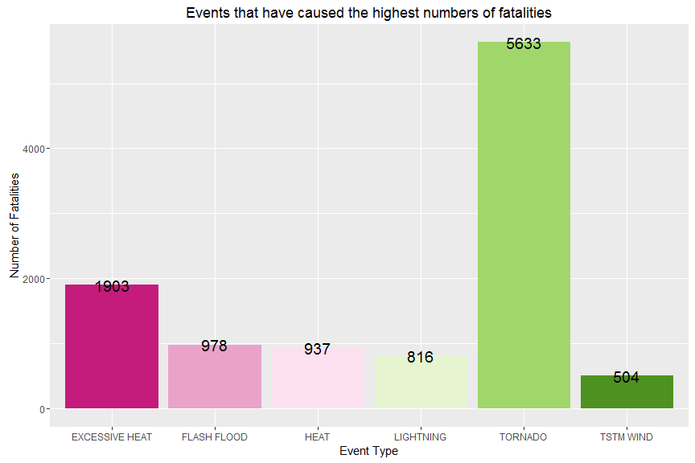
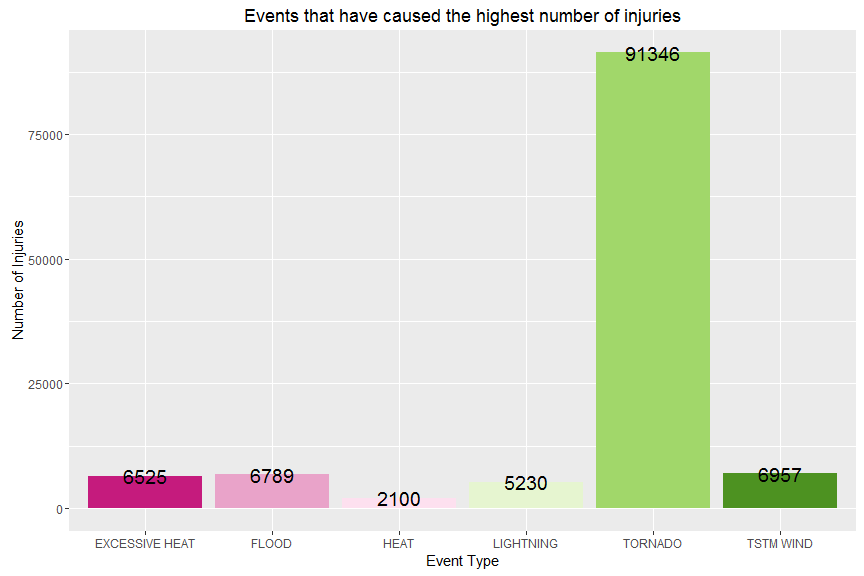
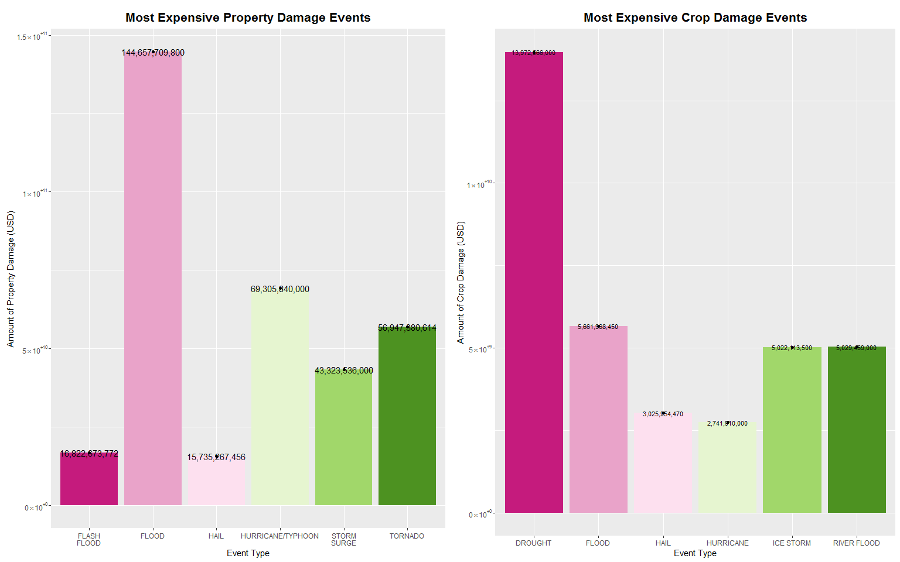

<span style="color:blue">SYNOPSIS</span>
-------------------------------------------------- 

This project involves exploring the U.S. National Oceanic and Atmospheric Administration's (NOAA) storm database. This database tracks characteristics of major storms and weather events in the United States, including when and where they occur, as well as estimates of any fatalities, injuries, and property damage.

985 weather events were observed and characterized. Tornadoes and floods are the most effective ones. During the period, there were more than **15,000 people deaths**. Around 35 % of them resulted of tornadoes. Excessive heat or heat was involved in 20 % of the cases. There were **140,000 injuries** inflicted. 65 % of these injuries were provoked by tornadoes. 
About damages, we have distinguished between Property Damages  - damage inflicted to private property (structures, objects, vegetation) as well as public infrastructure and facilities - and Crop Damages. *Property Damage* costs rise to **430 billions of US dollars**. *Crop Damage* costs rise to **50 billions of US dollars**. Flood are the major factor for property damage cost with 144 billions (representing 1/3 of the total amount) twice higher than Hurricane/Typhoon and more than three times the costs resulting of tornadoes. If we compute only the first four of them (Flood, Hurricane/Typhoon, Tornadoes and Storm Surge), they represent 75 % of the totl amount (around 320 billions). Regarding crop damages costs, the major factor was the drought (1/4 of the total amount) far beyond floods (5.6 billions, i.e 11 %), river floods (5 billions) and ice storms (5 billions too). 


The **data for this assignment** can be downloaded from the institutional web site:
[National Weather Service data](https://d396qusza40orc.cloudfront.net/repdata%2Fdata%2FStormData.csv.bz2)


<span style="color:blue">CONFIGURATION SETTINGS</span>
--------------------------------------------------


```r
sessionInfo()
```

```
## R version 3.2.2 (2015-08-14)
## Platform: i386-w64-mingw32/i386 (32-bit)
## Running under: Windows 7 (build 7601) Service Pack 1
## 
## locale:
## [1] LC_COLLATE=French_France.1252  LC_CTYPE=French_France.1252   
## [3] LC_MONETARY=French_France.1252 LC_NUMERIC=C                  
## [5] LC_TIME=French_France.1252    
## 
## attached base packages:
## [1] stats     graphics  grDevices utils     datasets  methods   base     
## 
## loaded via a namespace (and not attached):
## [1] formatR_0.10    tools_3.2.2     htmltools_0.3   yaml_2.1.13    
## [5] rmarkdown_0.9.2 knitr_1.11      stringr_0.6.2   digest_0.6.4   
## [9] evaluate_0.8
```

```r
Sys.setlocale("LC_TIME", "English")
```

```
## [1] "English_United States.1252"
```

```r
# setwd("./R/data")
```

 


```r
fileUrl <- "https://d396qusza40orc.cloudfront.net/repdata%2Fdata%2FStormData.csv.bz2"
setInternet2(use=TRUE)
download.file(fileUrl, destfile = "./stormdata2.csv", method = "libcurl")
```

<span style="color:blue">DATA PROCESSING</span>
-------------------------------------------------- 
We keep only the relevant variables, i.e. the following columns:

* Event Type (EVTYPE, col8)
* Fatalities (FATALITIES, col23)
* Injuries (INJURIES, col24)
* Property Damage US dollars (PROPDMG, col25)
* Property Damage Expenses - Magnitude (PROPDMGEXP, col26)
* Crop Damage in US dollars (CROPDMG, col27)
* Crop Damage Expenses  (CROPDMGEXP, col28)


```r
stormdata <- read.csv("stormdata2.csv", stringsAsFactors = FALSE, sep=',',header=TRUE,
                   colClasses = c(rep("NULL", 7), NA, rep("NULL", 14), rep(NA, 6), 
                                  rep("NULL", 9)))
```


```r
x <- nrow(stormdata)
```

There are **902297** observations.


```r
names <- names(stormdata)
str(stormdata)
```

'data.frame':	902297 obs. of  7 variables:
 $ EVTYPE    : chr  "TORNADO" "TORNADO" "TORNADO" "TORNADO" ...
 $ FATALITIES: num  0 0 0 0 0 0 0 0 1 0 ...
 $ INJURIES  : num  15 0 2 2 2 6 1 0 14 0 ...
 $ PROPDMG   : num  25 2.5 25 2.5 2.5 2.5 2.5 2.5 25 25 ...
 $ PROPDMGEXP: chr  "K" "K" "K" "K" ...
 $ CROPDMG   : num  0 0 0 0 0 0 0 0 0 0 ...
 $ CROPDMGEXP: chr  "" "" "" "" ...

```r
knitr::kable(head(stormdata))
```


EVTYPE     FATALITIES   INJURIES   PROPDMG  PROPDMGEXP    CROPDMG  CROPDMGEXP 
--------  -----------  ---------  --------  -----------  --------  -----------
TORNADO             0         15      25.0  K                   0             
TORNADO             0          0       2.5  K                   0             
TORNADO             0          2      25.0  K                   0             
TORNADO             0          2       2.5  K                   0             
TORNADO             0          2       2.5  K                   0             
TORNADO             0          6       2.5  K                   0             


The seven variables are EVTYPE, FATALITIES, INJURIES, PROPDMG, PROPDMGEXP, CROPDMG, CROPDMGEXP.

While displaying the top rows, we could observe that it seems to have a problem with the PROPDMGEXP & CROPDMGEXP columns. Let's investigate !

#### EXPLORATORY ANALYZIS


```r
tblprop <- table(stormdata$PROPDMGEXP)
knitr::kable(t(as.matrix(tblprop)))
```

           -    ?    +     0    1    2    3    4    5    6    7    8    B    h    H        K    m       M
-------  ---  ---  ---  ----  ---  ---  ---  ---  ---  ---  ---  ---  ---  ---  ---  -------  ---  ------
 465934    1    8    5   216   25   13    4    4   28    4    5    1   40    1    6   424665    7   11330


```r
tblcrop <- table(stormdata$CROPDMGEXP)
knitr::kable(t(as.matrix(tblcrop)))
```

           ?    0    2    B    k        K    m      M
-------  ---  ---  ---  ---  ---  -------  ---  -----
 618413    7   19    1    9   21   281832    1   1994

The raw dataset contains two columns, PROPDMGEXP and CROPDMGEXP, that are supposed to represent the magnitude of expenses respectively for Property and Crop. 

"Property damage estimates should be entered as actual dollar amounts. (...). Estimates should be rounded to three significant digits, followed by an alphabetical character signifying the magnitude of the number, i.e., 1.55B for $1,550,000,000 which signify the magnitude of the values in PROPDMG and CROPDMG respectively. The magnitude is either represented by numbers or letters. The numbers are simply exponent values. **The letters (eg. K - Thousands, M - Millions, B - Billions) have to be converted to exponent numbers**." (See [Documentation](https://d396qusza40orc.cloudfront.net/repdata%2Fpeer2_doc%2Fpd01016005curr.pdf), p.12)

It is clear that numbers were inserted by mistake. Since, there are only a handful of values compared to the total number of observations (around 3e-04 % for the PROPDMG and 2e-05 % for the CROPDMG), we will delete them. 

We need to be ascertained about the significance of the NULL value in the EXP column: does it mean that there were numbers that were inferior to one thousand ? In other words, were there three-figured numbers representing the amount of damages ?  Actually, there is a cue that it is not the case because two letters ("h" and "H") features, denoting hundreds number. But we need to check that.
So, we subset the original dataset when value of PROPEXPDMG is empty.


```r
stormdatanullprop = subset(stormdata, stormdata$PROPDMGEXP == "")
tblpropnull <- table(stormdatanullprop$PROPDMG)
knitr::kable(t(as.matrix(tblpropnull)))
```

      0   0.41    1    2    3    4    5    6    7    8    9   10   20   35   75
-------  -----  ---  ---  ---  ---  ---  ---  ---  ---  ---  ---  ---  ---  ---
 465858      1    4    7   16    9   11    6    3    2    3    8    4    1    1

```r
nullvalue <- nrow(stormdatanullprop)
```

We can observe that almost all the observations equates to 0. Therefore, we can consider that when the field of CROPDMGEXP's column is empty, observations are irrelevant and can be removed.

Then, we do the same about the PROPEXPDMG. we subset the original dataset when the PROPEXPDMG field is empty.


```r
stormdatanullcrop = subset(stormdata, stormdata$CROPDMGEXP == "")
tblcropnull <- table(stormdatanullcrop$CROPDMG)
knitr::kable(t(as.matrix(tblcropnull)))
```

      0    3    4
-------  ---  ---
 618410    1    2

There are less values involved and almost all of them are also equal to 0. We will consider to ignore these **465934** observations too.


#### TRANSFORMATIONS  

To fix PROPDMGEXP and CROPDMGEXP, the dataset is filtered on each unique value in the *EXP column. Each filtered dataset is passed into the mutate function by using R's pipe operator, %>%. The mutate function sets an integer exponent (2 for "H" and "h" hundreds, 3 for "K" thousands, 6 for "M" and "m" millions and 9 for "B" or "b" billions) on the row's *EXP column. Both subsets are then merged into one data frame using rbind().


If the value of *EXP is gibberish (? - + or no value), then the value is set to NA. In the later stages, when the total damage is calculated, these damage values are not taken into consideration.  


```r
library(dplyr)
```

```
## 
## Attaching package: 'dplyr'
## 
## The following objects are masked from 'package:stats':
## 
##     filter, lag
## 
## The following objects are masked from 'package:base':
## 
##     intersect, setdiff, setequal, union
```
First, we start with the PROPDMGEXP column.


```r
stormdata <- rbind(
  stormdata %>% filter(PROPDMGEXP %in% 0:8),
  stormdata %>% filter(PROPDMGEXP %in% c("", "?", "-", "+")) %>% mutate(PROPDMGEXP = NA),
  stormdata %>% filter(PROPDMGEXP %in% c("h", "H")) %>% mutate(PROPDMGEXP = 2),
  stormdata %>% filter(PROPDMGEXP == "K") %>% mutate(PROPDMGEXP = 3),
  stormdata %>% filter(PROPDMGEXP %in% c("m", "M")) %>% mutate(PROPDMGEXP = 6),
  stormdata %>% filter(PROPDMGEXP == "B") %>% mutate(PROPDMGEXP = 9)
)
```

And, then, we execute the same code for the CROPDMGEXP column.


```r
stormdata <- rbind(
  stormdata %>% filter(CROPDMGEXP %in% c(0, 2)),
  stormdata %>% filter(CROPDMGEXP %in% c("", "?")) %>% mutate(CROPDMGEXP = NA),
  stormdata %>% filter(CROPDMGEXP %in% c("k", "K")) %>% mutate(CROPDMGEXP = 3),
  stormdata %>% filter(CROPDMGEXP %in% c("m", "M")) %>% mutate(CROPDMGEXP = 6),
  stormdata %>% filter(CROPDMGEXP == "B") %>% mutate(CROPDMGEXP = 9)
)
```

We can check that this operation has worked well. There are still remaining NA values as we defined and numbers are well displayed in these two columns although they are formatted as characters.


```r
stormdatacheck <- head(stormdata)
knitr::kable(head(stormdata))
```


EVTYPE                FATALITIES   INJURIES   PROPDMG  PROPDMGEXP    CROPDMG  CROPDMGEXP 
-------------------  -----------  ---------  --------  -----------  --------  -----------
HAIL                           0          0       0.0  NA                  0  0          
HAIL                           0          0       0.0  NA                 20  0          
THUNDERSTORM WINDS             0          0       0.0  NA                  0  2          
DROUGHT                        0          0       0.0  NA                  0  0          
THUNDERSTORM WINDS             0          0       0.5  3                   0  0          
TORNADO                        0          0       5.0  3                   0  0          

In order to make calculations easier, we convert PROPDMG & CROPDMG's columns into integers.


```r
stormdata <- stormdata %>%
    # convert magnitudes to integers
    mutate(CROPDMGEXP = as.integer(CROPDMGEXP),
        PROPDMGEXP = as.integer(PROPDMGEXP))
## str(stormdata) - PROPDMG & CROPDMG have been correctly been transformed into integers.
```


<span style="color:blue">RESULTS</span>
-----------------------------------------
We want to calculate the amount of damages for crops and properties. To do so, we perform the following steps:

1. If PROPDMGEXP is NA, then PROPDAMAGE = NA, else PROPDMG  = PROPDMG * 10^PROPDMGEXP
2. If CROPDMGEXP is NA, then CROPDAMAGE = NA, else CROPDMG  = CROPDMG * 10^CROPDMGEXP
3. Finally, we remove all the unnecessary columns; i.e. of the PROPDMGEXP, PROPDMG, CROPDMGEXP, CROPDMG columns since they were merged into other ones.


```r
stormdatadaminjfat <- stormdata %>%
  mutate(PROPDAMAGE = ifelse(is.na(PROPDMGEXP), NA, PROPDMG * 10^PROPDMGEXP))
stormdatadaminjfat <- stormdatadaminjfat %>%
  mutate(CROPDAMAGE = ifelse(is.na(CROPDMGEXP), NA, CROPDMG * 10^CROPDMGEXP))
## remove columns that are not needed anymore
stormdatadaminjfat <- stormdatadaminjfat %>%
  mutate(PROPDMGEXP = NULL, PROPDMG = NULL, CROPDMGEXP = NULL, CROPDMG = NULL)
```

Doing so, we have gathered into one single dataframe with only 5 columns all the information needed:

* Damages (for Properties and Crops)
* Injuries
* Fatalities


```r
str(stormdatadaminjfat)
```

```
## 'data.frame':	902297 obs. of  5 variables:
##  $ EVTYPE    : chr  "HAIL" "HAIL" "THUNDERSTORM WINDS" "DROUGHT" ...
##  $ FATALITIES: num  0 0 0 0 0 0 0 0 0 0 ...
##  $ INJURIES  : num  0 0 0 0 0 0 0 0 0 0 ...
##  $ PROPDAMAGE: num  NA NA NA NA 500 5000 5000 100000 5000 25000 ...
##  $ CROPDAMAGE: num  0 20 0 0 0 0 5 50 25 25 ...
```

```r
nbevents <- nrow(table(stormdata$EVTYPE))
```

Then, we group the dataset by type of events (there are 985 different ones). Then the sum of the values of each column is calculated. This is done by using the group_by() and summarize() functions in dplyr. And finally, we compute the sum for each columns.


```r
summary <- summarize(group_by(stormdatadaminjfat, EVTYPE),
    INJURIES = sum(INJURIES, na.rm = T),
    CROPDAMAGE = sum(CROPDAMAGE, na.rm = T),
    PROPDAMAGE = sum(PROPDAMAGE, na.rm = T),
    FATALITIES = sum(FATALITIES, na.rm = T))

total_fatalities = sum(summary$FATALITIES)
total_injuries = sum(summary$INJURIES)
total_propdamage = sum(summary$PROPDAMAGE)
total_cropdamage = sum(summary$CROPDAMAGE)
```

The total amount of fatalities rises to 15145 for the whole period, from 1950 to November 2011. The total amount of injuries equates to `format(total_injuries, scientific=FALSE)`. 

Regarding the cost of damages, damage costs to properties that represents 4.2822487\times 10^{11} US"$", are almost ten times higher than the ones inflicted to crops, equal to 4.9104192\times 10^{10} US dollars.   

Then the summary is sorted in descending order for each impact variable (INJURIES, FATALITIES, DAMAGE), and the result is stored in a new variable named to the impact variable. Only the first 6 rows corresponding to event type and impact variable are kept.


```r
# arrange and assign each impact to a separate variable
Injuries <- arrange(summary, desc(INJURIES))[1:6, c("EVTYPE", "INJURIES")]
Fatalities <- arrange(summary, desc(FATALITIES))[1:6, c("EVTYPE", "FATALITIES")]
Propdamage <- arrange(summary, desc(PROPDAMAGE))[1:6, c("EVTYPE", "PROPDAMAGE")]
Cropdamage <- arrange(summary, desc(CROPDAMAGE))[1:6, c("EVTYPE", "CROPDAMAGE")]
```

A custom color scheme is generated randomly and used for all plots.

```r
library(RColorBrewer)
# This site (http://vis.supstat.com/2013/04/plotting-symbols-and-color-palettes/) was very helpful
brewer.pal(6, "PiYG")
```

```
## [1] "#C51B7D" "#E9A3C9" "#FDE0EF" "#E6F5D0" "#A1D76A" "#4D9221"
```

```r
plot_color_scheme <- c("#C51B7D", "#E9A3C9", "#FDE0EF", "#E6F5D0", "#A1D76A", "#4D9221")
```
#### HUMAN COST

This section will be divided into two parts :

* Fatalities
* Injuries

##### FATALITIES


```r
library(ggplot2)
```

```
## Warning: package 'ggplot2' was built under R version 3.2.3
```

```r
# Events that have caused the highest number of fatalities
ggplot(data = Fatalities, aes(x = EVTYPE, y = FATALITIES)) +
  aes(fill = EVTYPE) +
  scale_fill_manual(values = plot_color_scheme) +
  guides(fill = FALSE) +
  geom_bar(stat = "identity") +
  geom_text(aes(label=FATALITIES), size=5, color = "black") +
  xlab("Event Type") +
  ylab("Number of Fatalities") +
  ggtitle("Events that have caused the highest numbers of fatalities")
```

 

Among the 15145 fatalities, tornadoes have caused **5633** deaths.

##### INJURIES


```r
# Events that have caused the highest number of injuries
ggplot(data = Injuries, aes(x = EVTYPE, y = INJURIES)) +
  aes(fill = EVTYPE) +
  scale_fill_manual(values = plot_color_scheme) +
  guides(fill = FALSE) +
  geom_bar(stat = "identity") +
  geom_text(aes(label=INJURIES), size=5, color = "black") +
  xlab("Event Type") +
  ylab("Number of Injuries") +
  ggtitle("Events that have caused the highest number of injuries")
```

 

Among the 140528 injuries, tornadoes were the first cause with **9.1346\times 10^{4}** persons hurt.


#### ECONOMIC COST 

For the final plot related to damage costs, we first need to make some cleansing tasks. We want the axis labels to start from 10^-10 (or 10^09) and then display 5 x 10^-10 (or 5 x 10^-09 for Crop Damage Costs), 1 x 10^-11 (or 1 x 10^-10), 1.5 x 10^-11 (or 1.5 x 10^-10) .
We make a function scientific_10() adding a parse() on "e" symbol (and changing 'x' to the correct 'times' symbol). Then, we will use "scale-y-continuous 
(label=scientific_10)" in our ggplot (geom-point).


```r
library(scales)
```

```
## Warning: package 'scales' was built under R version 3.2.3
```

```r
scientific_10 <- function(x) {
  parse(text=gsub("e", " %*% 10^", scientific_format()(x)))
}
```

To format text labels - I want numbers more easily readable -, I will implement a dot function. And I will add a new column (X2) in each dataframe Propdamage and Cropdamage. This new column will contain numbers correctly formatted (each third figure will be separated by a comma) and able to be used by our ggplot plot. 


```r
dot <- function(x, ...) { 
  format(x, ..., big.mark = ",", scientific = FALSE, trim = TRUE)
}

Propdamage$X2 <- as.numeric(as.character(Propdamage$PROPDAMAGE))
col <- "X2"
new_col <- paste0(col,"_dot")
Propdamage[,new_col] <- dot(Propdamage[,col])

Cropdamage$X2 <- as.numeric(as.character(Cropdamage$CROPDAMAGE))
col <- "X2"
new_col <- paste0(col,"_dot")
Cropdamage[,new_col] <- dot(Cropdamage[,col])
```

So, finally, it's time for a side-by-side plot comparing Propdamage and Cropdamage.


```r
# This page was very helpful: https://github.com/jbryer/likert/blob/master/R/label_wrap_mod.r
label_wrap_mod <- function(label, width = 10) {
  sapply(strwrap(as.character(label), width=width, simplify=FALSE), 
         paste, collapse="\n")
}


d1 <- ggplot(data = Propdamage, aes(x = EVTYPE, y = PROPDAMAGE)) +
  aes(fill = EVTYPE) +
  scale_fill_manual(values = plot_color_scheme) +
  guides(fill = FALSE) +
  geom_bar(stat = "identity") +
  geom_text(aes_string(label=new_col), size=4, color = "black") +
  xlab("Event Type") +
  ylab("Amount of Property Damage (USD)") +
  geom_point()+scale_y_continuous(label=scientific_10) + 
  scale_x_discrete(label=label_wrap_mod) +
  ggtitle("Most Expensive Property Damage Events") +
  theme(plot.title = element_text(size=16, face="bold", 
    margin = margin(10, 0, 10, 0)))

d2 <- ggplot(data = Cropdamage, aes(x = EVTYPE, y = CROPDAMAGE)) +
  aes(fill = EVTYPE) +
  scale_fill_manual(values = plot_color_scheme) +
  guides(fill = FALSE) +
  geom_bar(stat = "identity") +
  geom_text(aes_string(label=new_col), size=3, color = "black") +
  xlab("Event Type") +
  ylab("Amount of Crop Damage (USD)") +
  geom_point()+scale_y_continuous(label=scientific_10) +
  ggtitle("Most Expensive Crop Damage Events") +
  theme(plot.title = element_text(size=16, face="bold", 
    margin = margin(10, 0, 10, 0)))
# scale_fill_discrete(guide=FALSE)
# (axis.text=element_text(size=12),
# axis.title=element_text(size=14,face="bold"))

library(grid)
pushViewport(viewport(layout = grid.layout(1, 2)))
print(d1, vp = viewport(layout.pos.row = 1, layout.pos.col = 1))
```

```
## Don't know how to automatically pick scale for object of type AsIs. Defaulting to continuous
```

```r
print(d2, vp = viewport(layout.pos.row = 1, layout.pos.col = 2))
```

```
## Don't know how to automatically pick scale for object of type AsIs. Defaulting to continuous
```

 

**Beware**: the scale for each plot is different. The right panel for Crop Damage costs starts from 10^9 whereas the left panel begins with 10^10 value. That is is the meaning of the warning *("Don't know how to automatically pick scale for object of type AsIs. Defaulting to continuous")* when calling the print function.
The idea of making a side-by-side plot though relevant here may be risky for interpretation. But we can better compare events that occur more frequently for the two types of damages than figures. For instance, we observe that flood cause more damage costs (145 US$ billions) for properties but come second regarding the crop damages and represents half of the highest event that is Drought (12.5 US$ billions).


<span style="color:blue">CONCLUSION</span>
-----------------------------------------

I did not intend to make a temporal analyzis but it would have made sense to do so due to the **global warming**. In the same perpective, taking into account **inflation** would have been relevant to adjust the value of a dollar through the period - to do so, we could use the table 24 that has the Annual Average Consumer Price Index (CPI) and normalized to 1982-84 (cpi=100). 

Furthermore, the storm that hit the US East Coast over this month caused at least 20 dead in several states and likely cost businesses and residents about $2.5 billion to $3 billion and damage to property and infrastructure was limited. [CNN article](http://money.cnn.com/2016/01/25/news/economy/blizzard-costs/). 
According this article, " This (Jonas Storm) $3 billion loss estimate is peanuts compared to the $26 billion in lost business and wages caused by Superstorm **Sandy** in 2012, according to Moody's Analytics. And Sandy caused an additional **$45 billion in physical damage**. The most expensive storm on record was **Hurricane Katrina** in 2005, which cost businesses and individuals $28 billion in lost sales and wages, in addition to the **$129 billion in physical damage**."
However, that led us to question the estimated costs in the National Weather Service Database since it does not include the lost working days (businesses that lost sales and employees that lost wages) but only amounts for insurance companies.

